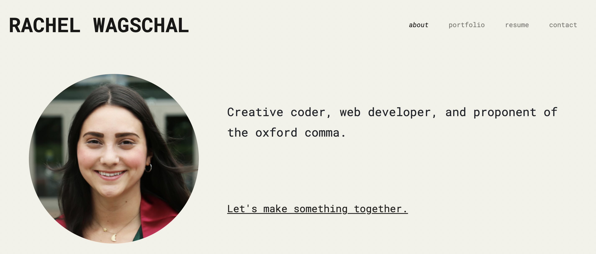

# React Portfolio

My [professional portfolio](https://rawagschal.github.io/) bulit with React.js.

    

## Features

* About Me
* Contact Information
* Resume and Overview of Skills
* Portfolio of Live Sites

## Contributions

Would love to hear your feedback and suggestions! [Send me an email](mailto:rawagschal@gmail.com) or [open an issue on the repository](https://github.com/rawagschal/rawagschal.github.io/issues).